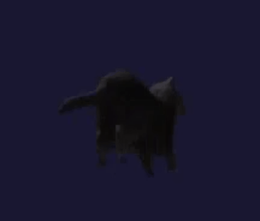

# 🧩 Game Engine — ECS • Bullet Physics • DirectX 11 • Scripting DLL

Ce projet est un moteur de jeu temps réel construit autour d’une architecture **Entity–Component–System (ECS)**, d’une simulation physique complète via **Bullet Physics**, d’un pipeline de rendu **DirectX 11**, et d’un système de **scripting modulaire** basé sur des DLL externes.

Il s’agit d’un moteur pédagogique mais robuste, conçu pour être clair, modulaire et extensible.

---

## ✨ Fonctionnalités principales

### 🧱 Architecture ECS maison
- Gestion complète des entités, composants et systèmes.
- Stockage contigu des composants (ComponentArray).
- Systèmes automatiques basés sur des signatures.
- Coordinator centralisé pour manipuler l’ECS.

### 🎮 Physique Bullet intégrée
- Rigid bodies (dynamiques, statiques).
- Colliders : Box, Sphere, Capsule.
- Forces continues et impulsions.
- Joints : Point2Point, Hinge, Fixed.
- Character Controller (btKinematicCharacterController).
- Zones Trigger (OnEnter / OnStay / OnExit).

### 🎨 Rendu DirectX 11
- Device + SwapChain + RenderTargets.
- Shaders HLSL (VS/PS).
- Pipeline state (rasterizer, depth-stencil).
- Chargement de modèles `.obj` (tinyobjloader).
- Chargement de textures (WIC).
- Matrices world/view/proj gérées par le moteur.

### 🧩 Scripting modulaire via DLL
- Chargement dynamique d’un module externe (`GameModule.dll`).
- Création/destruction de scripts via fonctions exportées.
- Support des scripts internes via `RegisterScript<T>()`.

### 🧮 MathsLib
- `Vector3<T>` complet (Dot, Cross, Lerp, Normalize…)
- `Quaternion<T>` (Euler, Slerp, LookRotation…)

---

## 📁 Structure du projet

Engine/  
├── ECS/  
│    ├── Coordinator  
│    ├── EntityManager  
│    ├── ComponentManager  
│    ├── SystemManager  
│    ├── Components/  
│    └── Systems/  
├── Physics/  
│    ├── PhysicsBodySystem  
│    ├── ColliderSystem  
│    ├── ForceSystem  
│    ├── JointSystem  
│    ├── TriggerSystem  
│    └── CharacterControllerSystem  
├── Renderer/  
│    ├── Renderer.h/.cpp  
│    ├── WICTextureLoader  
│    └── NewOBJLoader  
├── Script/  
│    ├── ScriptAPI.h  
│    └── ScriptManager.h/.cpp  
└── MathsLib/  
├── Vector3  
└── Quaternion  

---

## 🚀 Compilation

### Prérequis
- Windows 10/11
- Visual Studio 2022
- DirectX 11 SDK (inclus dans Windows SDK)
- GLFW
- Bullet Physics
- tinyobjloader

### Compilation
1. Cloner le dépôt :
   ```bash
   git clone https://github.com/ton-projet/ton-moteur.git
2. Ouvrir la solution Visual Studio.
3. Compiler en Debug ou Release.
4. Lancer l’exécutable.

## 🧪 Exemple minimal : créer une entité

```bash
Entity e = coord.CreateEntity();

coord.AddComponent<Transform>(e, {
    {0, 1, 0}, // position
    Quaternion<float>::Euler(0, 0, 0),
    {1, 1, 1}  // scale
});

coord.AddComponent<MeshRenderer>(e, renderer.CreateMeshRenderer(obj.mesh));
coord.AddComponent<MaterialData>(e, { texture });
```
## 🎮 Exemple : ajouter un script

```bash
coord.AddComponent<Script>(player, { "PlayerController" });
```
Dans la DLL : 

```bash
extern "C" __declspec(dllexport)
IScript* CreateScript(const char* name) {
    if (strcmp(name, "PlayerController") == 0)
        return new PlayerController();
    return nullptr;
}
```
## 📘 Documentation technique

- La Technical Design Document (architecture ECS, pipeline physique, pipeline de rendu, scripting, maths, etc.) est disponible dans le dossier Externe puis sous le nom de TDD Moteur.pdf.

- La documentation complète du projet est disponible ici 👉 https://gamingcampus-milliebourgois-25-26.github.io/moteur-3d-nengine/ 👈

## 📸 Captures d’écran

  

  

## 👤 Auteur
Développé par AAAAAAHHH ZEBIIIII.
Projet pédagogique et moteur expérimental.
